# DevSecOps Project

**Author:** Prasad Moru

A production-grade DevSecOps implementation that deploys a cloud-native e-commerce platform on AWS EKS — covering everything from application architecture and CI/CD security scanning, to secrets management, advanced deployment strategies, and a full observability stack.

---

## 🎓 Udemy Course

> 🚀 **[Click here to enroll in the Full DevSecOps Course on Udemy](https://www.udemy.com/share/10etiV3@uOO43TjDfO8Y3_QRPKIKH7qVhk8spE11yA7ijSvVxDQavjkFnOQKW5_OziKrGd3p/)**  
> Learn how to build and secure a production-grade cloud-native platform on AWS EKS from scratch.

---

## Table of Contents

- [Application Architecture](#1-application-architecture)
- [CI/CD Pipeline & Security Scanning](#2-cicd-pipeline--security-scanning)
- [AWS EKS Infrastructure with Terraform](#3-aws-eks-infrastructure-with-terraform)
- [Centralized Secrets Management — HashiCorp Vault](#4-centralized-secrets-management--hashicorp-vault)
- [Microservices Running in EKS Cluster](#5-microservices-running-in-eks-cluster)
- [Canary Deployment](#6-canary-deployment)
- [Blue-Green Deployment](#7-blue-green-deployment)
- [Resource Monitoring & Alerting](#8-resource-monitoring--alerting)
- [Log Collection with Beats & ELK](#9-log-collection-with-beats--elk)
- [Application Logging — ELK & EFK Stack](#10-application-logging--elk--efk-stack)
- [Application Performance Monitoring — DataDog](#11-application-performance-monitoring--datadog)
- [Service Mesh & Telemetry — Istio / Kiali / Jaeger](#12-service-mesh--telemetry--istio--kiali--jaeger)
- [Tools & Technologies](#tools--technologies)

---

## 1. Application Architecture

The platform is an e-commerce store made up of multiple microservices. Customers interact with the **store-front** (Vue.js), while employees manage orders through the **store-admin** panel (Vue.js). Behind the scenes, the **order service** (Node.js) handles incoming orders and publishes them to **RabbitMQ**. The **product service** (Rust) manages the catalog, the **makeline service** (Go) consumes orders from the queue and persists them to **MongoDB**, and the **AI service** (Python) adds intelligent features powered by OpenAI. Virtual customer and worker services simulate real traffic for testing.

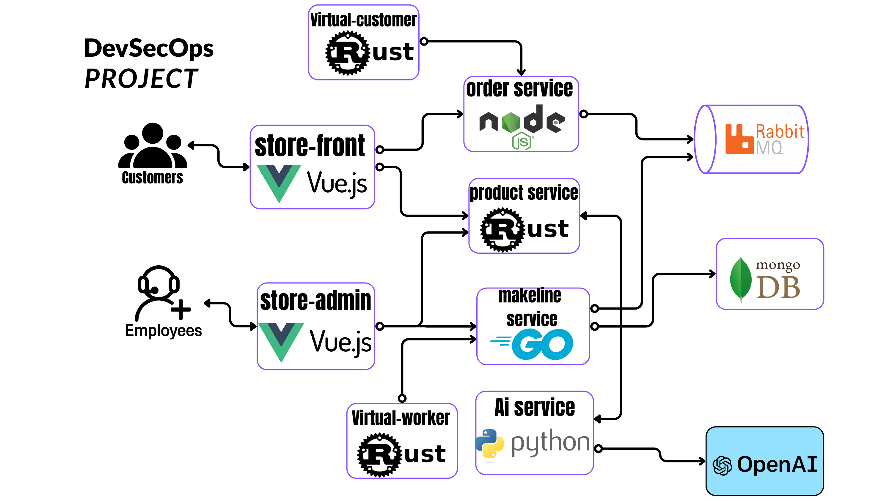

---

## 2. CI/CD Pipeline & Security Scanning

Every code push triggers a GitHub Actions workflow running on a **Self-Hosted Runner**. Before any image reaches the container registry, the pipeline enforces a full security gate:

- **SonarQube** performs Static Application Security Testing (SAST) — flagging code smells, bugs, and vulnerabilities
- **OWASP Dependency-Check** scans all third-party libraries for known CVEs
- **Trivy** scans the final Docker image for OS and library-level vulnerabilities

Each container image is tagged with both a semantic version and the Git commit SHA (e.g., `ai-service:1.0.2-0209da3`), giving full traceability from a running container back to the exact commit that produced it.

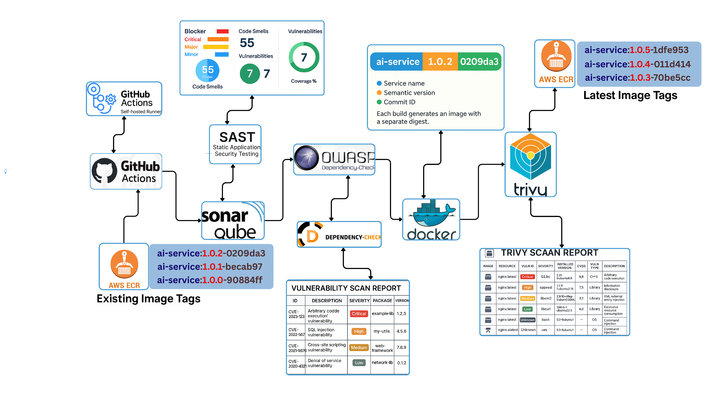

---

## 3. AWS EKS Infrastructure with Terraform

The entire cloud infrastructure is defined as code using **Terraform** and provisioned automatically via **GitHub Actions**. The setup covers three environments — **DEV**, **STG**, and **PRD** — each sharing the same modular Terraform base with environment-specific variable overrides.

The infrastructure includes a custom **VPC** with public and private subnets across multiple availability zones, an **EKS control plane**, managed **Node Groups** with autoscaling, an **ALB Ingress Controller** for traffic routing, **EBS-CSI** and **VPC-CNI** drivers for storage and networking, and **ECR** for container image storage. Terraform state is stored remotely in **Amazon S3**.

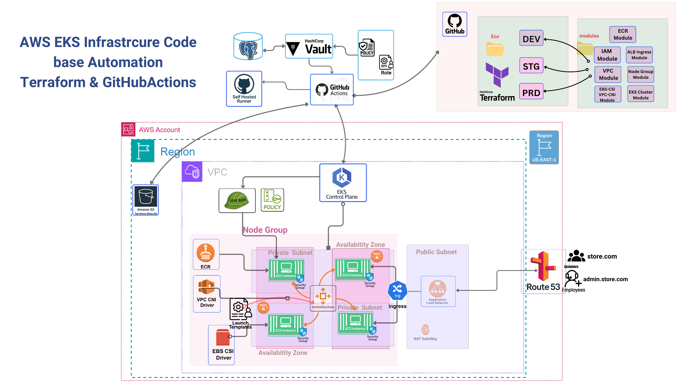

---

## 4. Centralized Secrets Management — HashiCorp Vault

No secrets are hardcoded anywhere in the codebase. All credentials are stored in **HashiCorp Vault** and injected into pods at runtime using the **Vault Agent Injector** via Kubernetes Service Accounts.

The secrets managed include Datadog API and APP keys, Webhook API key for Prometheus/Alertmanager integration, Azure OpenAI and OpenAI API keys for the AI service, RabbitMQ credentials for both the order service and makeline service, and MongoDB credentials for the makeline service. Alerts on secret access flow through to **Slack**.

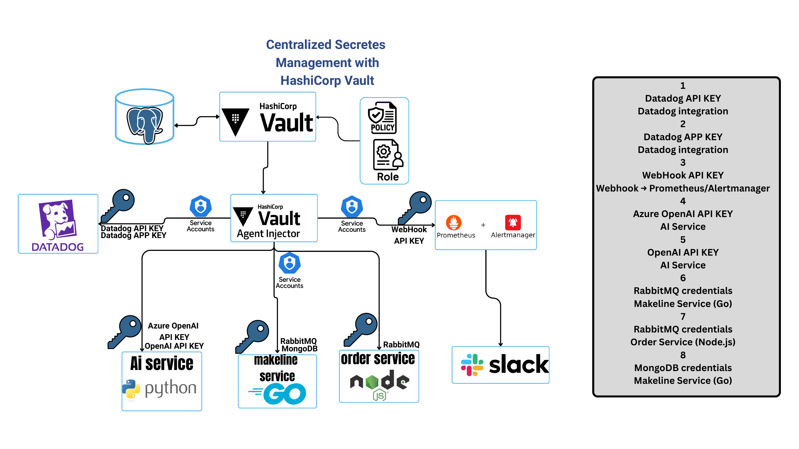

---

## 5. Microservices Running in EKS Cluster

All microservices run as pods across EC2 node groups inside the EKS cluster in **us-east-1**. Traffic flows in from **Route 53 → ALB Ingress Controller → Ingress → Services**. Each pod runs alongside an **Envoy** sidecar proxy (for Istio service mesh), a **Vault init** container for secret injection, **Datadog DaemonSet** agents for metrics, and **Beats DaemonSet** agents for log collection. The AI service connects outbound to both **OpenAI** and **Azure OpenAI DALL-E**.

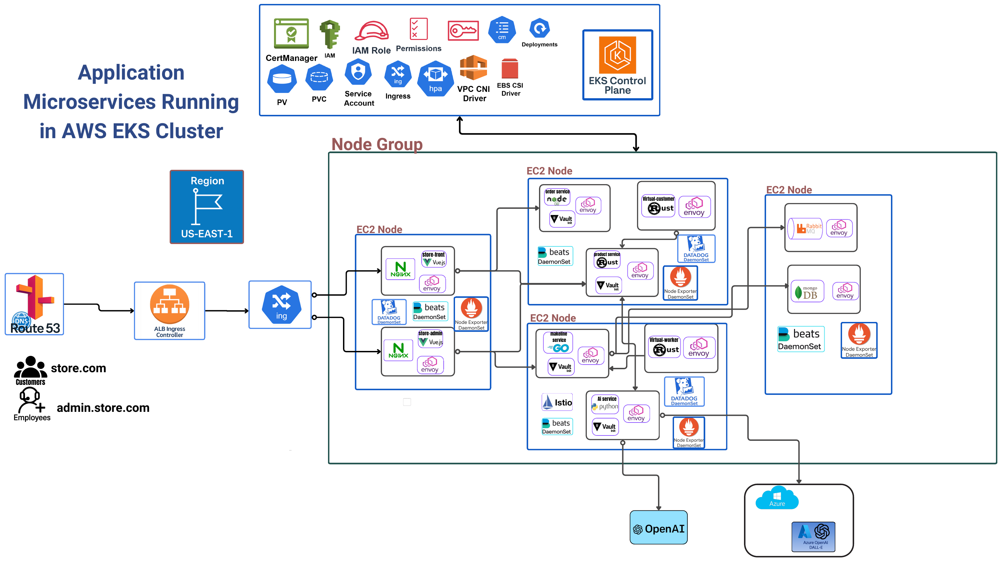

---

## 6. Canary Deployment

New application versions are rolled out gradually using **Argo Rollouts** with a Canary strategy. When a new image is pushed to **AWS ECR**, the **Auto Image Updater** detects it and triggers the rollout via **Argo CD** and **Helm**.

Traffic is progressively shifted from V1 pods to V2 pods in stages — 20%, 40%, 60%, 80%, then 100%. At each stage, an **AnalysisTemplate** evaluates the **P95 latency** and application health metrics from **DataDog**. If metrics degrade at any step, the rollout automatically pauses or rolls back.

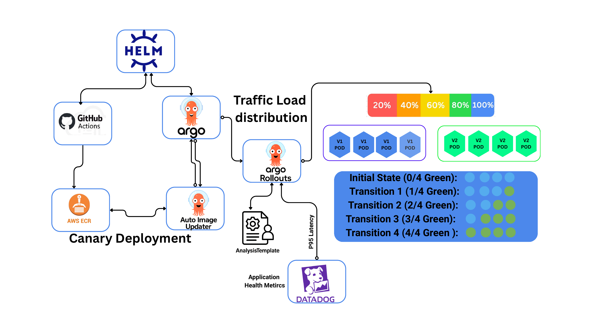

---

## 7. Blue-Green Deployment

For zero-downtime releases that require an instant cutover, **Argo Rollouts** also supports a Blue-Green strategy. Two full sets of pods run in parallel — the active **V1** (Blue) serving 100% of traffic, and the new **V2** (Green) running as a preview service.

Once V2 is validated against health metrics, traffic is switched instantly — V2 becomes active and V1 is kept on standby for immediate rollback if needed. There is no partial state or traffic split during the switch.

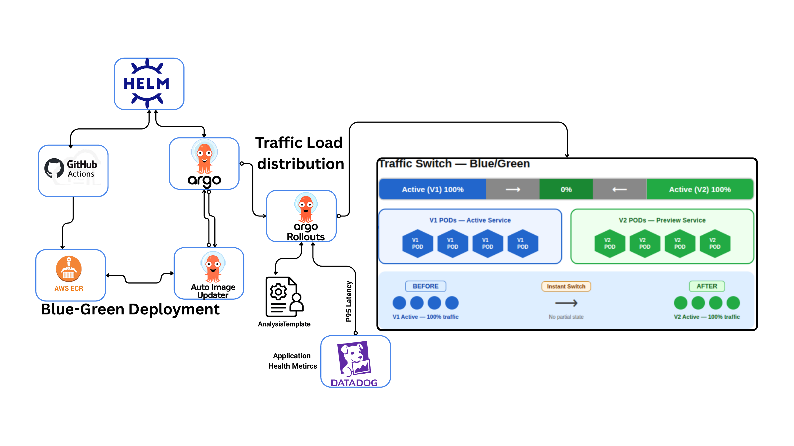

---

## 8. Resource Monitoring & Alerting

Infrastructure and application metrics are collected from every EC2 node using **Node Exporter DaemonSets** and **Datadog DaemonSets** running alongside each pod. All metrics flow into **Prometheus**, which evaluates alerting rules and routes firing alerts through **Alertmanager → Slack**. A **Grafana** dashboard provides a live operational view across the entire cluster.

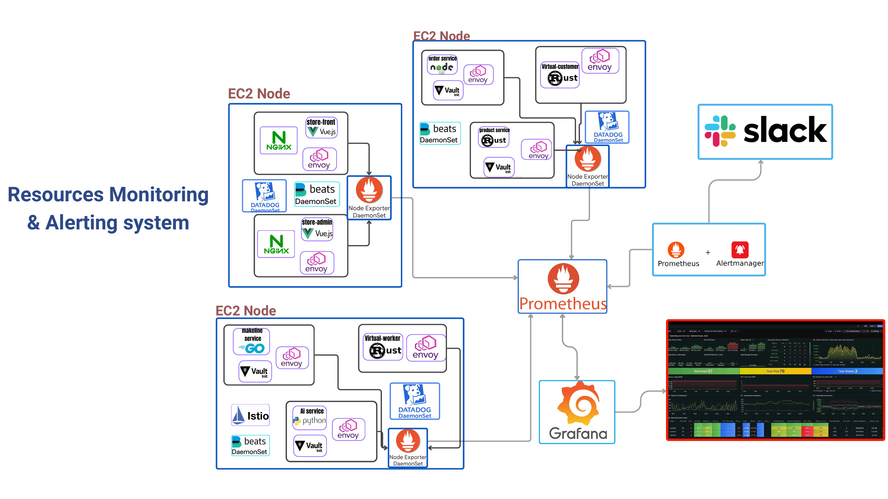

---

## 9. Log Collection with Beats & ELK

Logs from every pod and node process are collected by **Beats DaemonSets** running on each EC2 node. The Beats agents ship logs to **Logstash**, which processes and forwards them to **Elasticsearch** for indexing. **Kibana** provides the search and visualisation interface, with dashboards showing log volume, error distribution, and per-service breakdowns in real time.

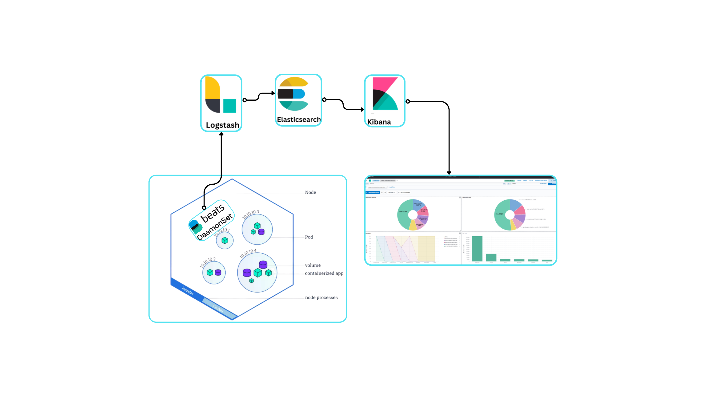

---

## 10. Application Logging — ELK & EFK Stack

The full logging pipeline spans all EC2 nodes in the cluster. Each node runs a **Fluentd** agent (EFK) that collects container logs and ships them to a centralised **Fluentd Aggregator**. From there, logs flow into **Elasticsearch** and are visualised in **Kibana** — giving a unified view of logs from all services: store-front, store-admin, order service, product service, makeline service, AI service, virtual-customer, and virtual-worker.

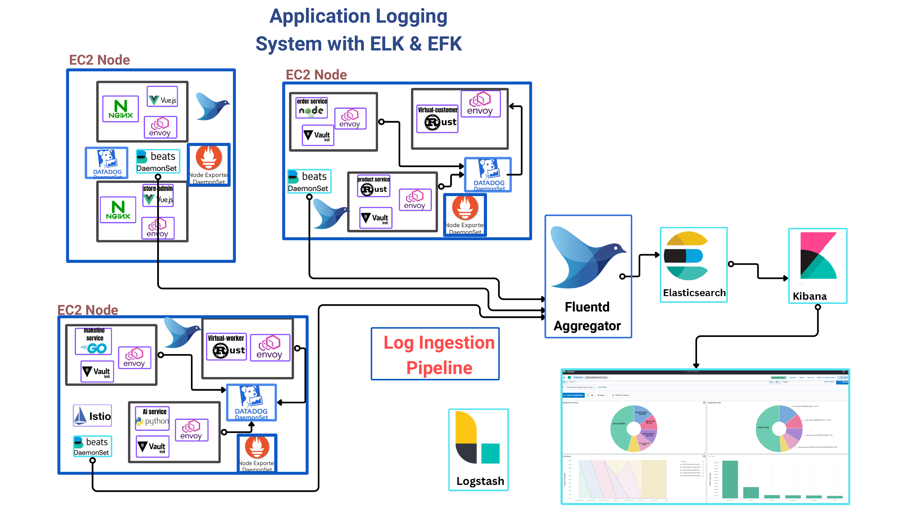

---

## 11. Application Performance Monitoring — DataDog

**DataDog DaemonSet** agents run on every EC2 node alongside **Node Exporter** to collect infrastructure and application-level metrics. These feed into **DataDog APM** for distributed tracing across services, and **DataDog RUM (Real User Monitoring)** for tracking real user sessions, page load times, and geographic traffic distribution — all visible in a single DataDog dashboard.

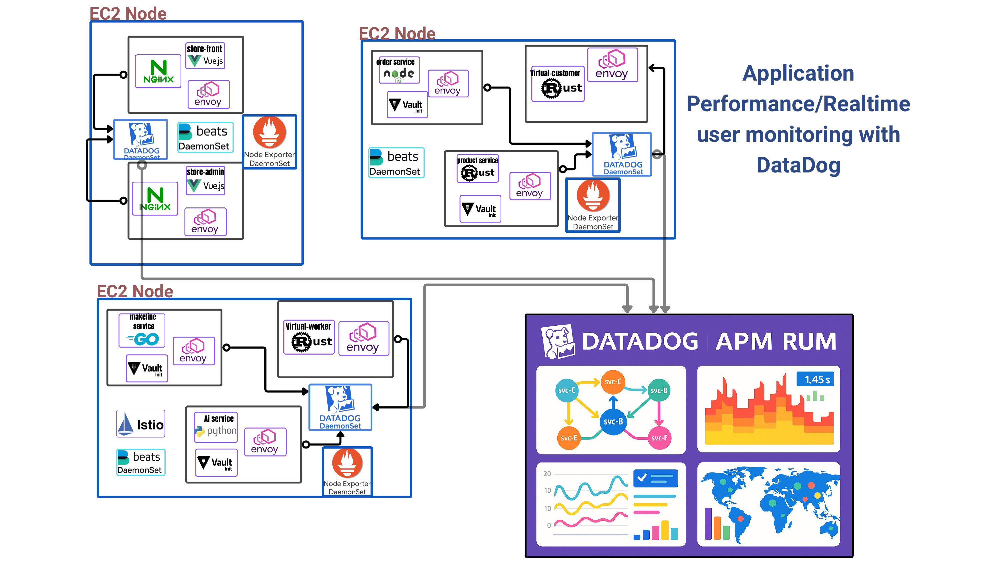

---

## 12. Service Mesh & Telemetry — Istio / Kiali / Jaeger

All service-to-service communication is managed by **Istio**, with **Envoy** sidecars injected into every pod. Istio enforces mutual TLS, handles retries and circuit breaking, and emits telemetry to **Prometheus**. **Kiali** provides a live visual topology of the service mesh — showing traffic flow, error rates, and health between every microservice. **Jaeger** captures distributed traces so any single request can be followed end-to-end across the order service, product service, makeline service, and AI service.

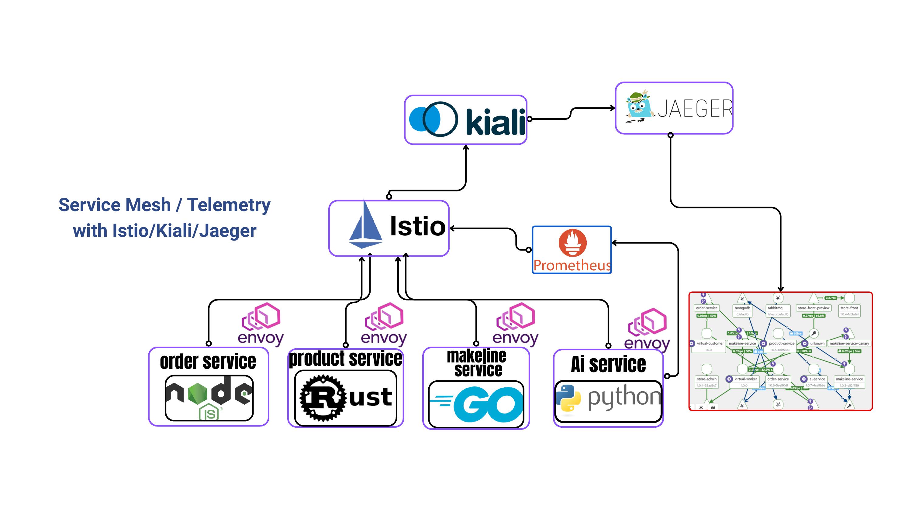

---

## Tools & Technologies

| Category | Tools |
|---|---|
| Cloud & Orchestration | AWS EKS, EC2, ECR, S3, Route 53, ALB |
| Infrastructure as Code | Terraform, GitHub Actions |
| Application Stack | Vue.js, Node.js, Go, Rust, Python |
| Messaging & Storage | RabbitMQ, MongoDB |
| Security Scanning | SonarQube, OWASP Dependency-Check, Trivy |
| Secrets Management | HashiCorp Vault |
| Deployment | Argo CD, Argo Rollouts, Helm |
| Monitoring & Alerting | Prometheus, Grafana, Alertmanager, Slack |
| Logging | Beats, Logstash, Fluentd, Elasticsearch, Kibana |
| APM & RUM | DataDog APM, DataDog RUM |
| Service Mesh | Istio, Envoy, Kiali, Jaeger |
| AI | OpenAI, Azure OpenAI DALL-E |

---

  

